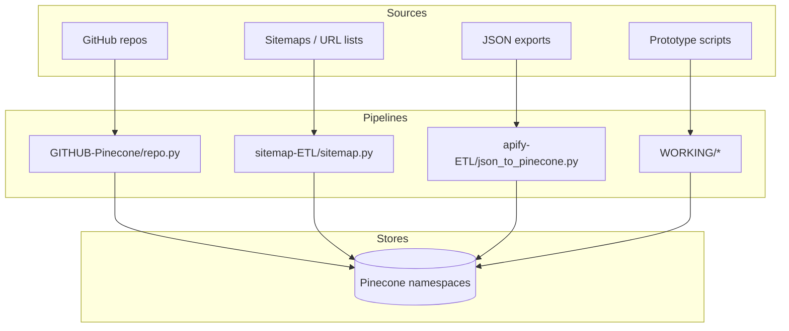

> **Operational Note:** Rendy reports must pair Postgres SQL metrics with Research-Agent semantic context, and default views should exclude $0 renewals/opportunities unless explicitly requested. Keep both data sources synchronized in every workflow.

# Rendy ETL Workbench

All ingestion pipelines for this checkout of Rendy live here. The maintained flows currently target GitHub repositories, sitemap/URL inputs, and JSON exports (Apify-style), with `WORKING/` reserved for experiments.

## Flow Overview


## Folder Index
| Folder/File | Description | Outputs | Detailed README |
| --- | --- | --- | --- |
| `GITHUB-Pinecone/` | Tarball-first GitHub crawler with doc/code chunking and ledger support. | Pinecone vectors | `GITHUB-Pinecone/README.md` |
| `sitemap-ETL/` | Playwright-based sitemap fetch + URL-only embedding pipeline. | Pinecone vectors | _(script docstring)_ |
| `apify-ETL/` | JSON/JSONL `(url, text)` loader (`json_to_pinecone.py`). | Pinecone vectors | _(script docstring)_ |
| `WORKING/` | Experimental variants (alternate GitHub flow and legacy sitemap loader). | Varies | `WORKING/README.md` |
| `create_stg_opportunity_export.sql` | SQL helper for stage export shaping. | SQL | _(inline SQL comments)_ |
| `stg_opportunity_export_columns.csv` | Column map companion for stage exports. | CSV | _(self-describing)_ |
| `stream_column.py` | Utility helper for stream-style column handling. | Script utility | _(inline comments)_ |
| `data-demo` | Placeholder for local demo data references. | Data stubs | _(none)_ |

## Shared Behavior & Conventions
- **Config-first scripts**: current ETL scripts are primarily driven by in-file `CONFIG` dictionaries and environment fallbacks (not argparse-heavy CLIs).
- **Embeddings and dimensions**: `text-embedding-3-large` (3072) and `text-embedding-3-small` (1536) are supported; keep Pinecone index dimensions aligned.
- **Ledgers**: each flow writes a local ledger (`.json`) to skip unchanged content across reruns.
- **Sync deletes**: `SYNC_DELETE_MISSING=True` prunes stale vectors from the target namespace.
- **Namespace strategy**: each loader supports namespace modes (for example `single`, `per_repo`, or `by_host`) in `CONFIG`.

## Configuration Checklist
1. Set `OPENAI_API_KEY` and `PINECONE_API_KEY` via environment variables or replace placeholder values in script `CONFIG`.
2. Choose an index name and embedding model, then verify index dimensions match model output.
3. Set source-specific inputs in each script (`REPOS`, `SITEMAPS`, or `JSON_PATH`).
4. Install dependencies required by the specific pipeline before first run.
5. For Playwright-based sitemap flows, run `playwright install chromium` once.

## Quick Runbook Examples
- **GitHub repos -> Pinecone**
  ```bash
  cd ETL/GITHUB-Pinecone
  # edit CONFIG (REPOS, INDEX_NAME, NAMESPACE_MODE, keys)
  python repo.py
  ```
- **Sitemap URLs -> Pinecone**
  ```bash
  cd ETL/sitemap-ETL
  # edit CONFIG (SITEMAPS, INDEX_NAME, NAMESPACE_MODE, keys)
  python sitemap.py
  ```
- **JSON/Apify export -> Pinecone**
  ```bash
  cd ETL/apify-ETL
  # edit CONFIG (JSON_PATH, INDEX_NAME, NAMESPACE, keys)
  python json_to_pinecone.py
  ```
- **Legacy/experimental variants**
  ```bash
  cd ETL/WORKING
  # choose gh-ETL/repo.py or www-pinecone/sitemap.py and edit CONFIG first
  ```

## Operational Tips
- Keep ledgers in persistent storage if running in ephemeral environments.
- Remove hard-coded placeholder keys from scripts before sharing or committing changes.
- Review include/exclude patterns and file-size limits to avoid indexing binaries.
- Run small source samples first, then enable sync-delete once behavior is confirmed.

Move into the folder-specific README (or script docstring) for detailed options.
