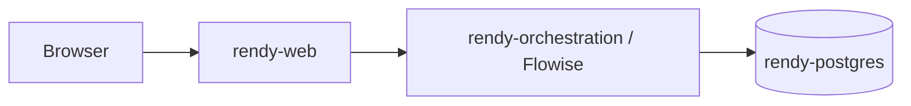

# Rendy on Render

Rendy is a Render-native starter for shipping an AI product with real service boundaries. Instead of forcing the UI, orchestration runtime, and data layer into one process, this repo uses Render Services the way an AI app actually benefits from them: one browser-facing service, one private orchestration service, and one managed database.

That matters because AI product work changes in layers. Frontend copy changes. Prompting and tool wiring changes. Retrieval and indexing changes. Render makes that easier to manage when each layer can evolve and redeploy independently.

## Why Render Works Well For AI Development

Render looks especially good here because it removes a lot of the glue work that usually slows AI teams down:

- **Service separation without platform sprawl**: the UI, orchestration runtime, and database are separate Render Services, but they still deploy from one Blueprint.
- **Private networking by default**: Flowise can stay behind the browser-facing app instead of being exposed directly to the public web.
- **Infrastructure as code**: the working topology lives in [`render.yaml`](render.yaml), not only in a dashboard.
- **Managed state**: Postgres is provisioned for you, and Flowise gets a persistent disk for logs, stored assets, and runtime state.
- **Fast iteration loops**: pushing code or changing env vars on a service gives you a clean redeploy path, which is exactly how AI apps tend to evolve.
- **Clear expansion path**: ETL can stay ad hoc at first and later move into cron jobs or workers without redesigning the whole repo.

For AI development specifically, that is a real productivity win. You spend less time wiring secrets, hostnames, ports, proxy rules, and data services by hand, and more time iterating on the assistant itself.

## Render Service Layout

| Service | Role | Why it helps AI development |
| --- | --- | --- |
| `rendy-web` | React UI plus same-origin Flowise proxy | Lets you iterate on the user experience without exposing orchestration internals directly to the browser. |
| `rendy-orchestration` | Full Flowise runtime | Keeps prompt/tool/agent orchestration isolated from the frontend so you can change AI behavior without turning every UI deploy into a platform exercise. |
| `rendy-postgres` | Managed Postgres for Flowise metadata and optional pgvector data | Gives you durable app state and a straightforward place to keep retrieval data if you want one database. |



## Why Render Services Are The Right Abstraction

For an AI product, Render Services line up cleanly with the actual responsibilities in the app:

- the browser-facing service owns UX, sessions, and request proxying
- the orchestration service owns prompts, tools, models, and workflow logic
- the database service owns durable state

That split is useful because AI apps rarely change all layers at once. Render lets you redeploy the layer you changed without pretending every prompt edit is a full platform event.

## What Render Already Wires For You

The Blueprint in [`render.yaml`](render.yaml) is doing useful platform work before you even touch a chatflow:

- provisions the three core resources
- injects Postgres connection details into the orchestration service
- generates the Flowise secret values that are easy to forget or misconfigure by hand
- mounts a persistent disk for Flowise state
- passes the orchestration service hostport into the UI service over Render's private network
- seeds the UI with the proxy and streaming defaults it needs

This is one of the main reasons Render is nice for AI apps. You are not just getting "hosting." You are getting the wiring between services, secrets, storage, and deploys already encoded in the stack definition.

## What `rendy-orchestration` Actually Gives You

`rendy-orchestration` is not just a single chat endpoint. It is the full Flowise service layer for the app.

That means it is where you get:

- Flowise API, CLI, and SDK-facing orchestration surfaces
- Assistant, Chatflow, and Agentflow runtime modes
- model/tool/prompt orchestration separate from the browser UI
- the LangChain / LlamaIndex / MCP / custom-tool integration surface that makes the assistant useful

That separation is a big deal for AI dev. Inside Render, it means orchestration behaves like a real private backend service instead of frontend-adjacent glue code.

## Why This Repo Shape Speeds Up AI Iteration

This repo is intentionally biased toward the real edit loops AI teams go through:

- **UI changes** live under [`UI/rendy_rt/`](UI/rendy_rt) and redeploy `rendy-web`.
- **Prompt, tool, and retrieval-flow changes** live in Flowise and affect `rendy-orchestration`.
- **Data ingestion changes** live under [`ETL/`](ETL) and can later move into scheduled jobs if needed.

That is a better fit for AI development than a monolith, because most changes are not full-stack changes. Render Services make it easy to keep those concerns separate.

## Quick Start On Render

1. Fork this repo for the Blueprint and UI service.
2. Fork Flowise and point the `rendy-orchestration.repo` value in [`render.yaml`](render.yaml) at your Flowise fork.
3. Review the `repo:` entries in [`render.yaml`](render.yaml) so `rendy-web` points at your repo and `rendy-orchestration` points at your Flowise fork.
4. Deploy the Blueprint from [`render.yaml`](render.yaml).
5. Open the `rendy-orchestration` service in Render, complete the Flowise first-run setup, and create the OpenAI/Postgres credentials you want to use inside the imported nodes.
6. If you want pgvector in Postgres, enable it in the target database:

```sql
CREATE EXTENSION vector;
```

7. Import [`chatflows/pgvector-template.json`](chatflows/pgvector-template.json) and [`chatflows/assistant-template.json`](chatflows/assistant-template.json).
8. Set `VITE_FLOWISE_CHATFLOW_ID` on the `rendy-web` service in Render.
9. Let Render redeploy `rendy-web`, then test the full browser path end to end.

## Day-To-Day Workflow

For this repo, the normal workflow should be thought of as service-level iteration on Render:

- push a UI change to the branch connected to `rendy-web`
- or change an env var on `rendy-web`
- let Render rebuild and redeploy
- review service logs, deploy output, and health in Render
- test the deployed service, not only a local shell session

That is especially useful for AI products because the deployed environment matters. Proxying, service-to-service networking, env vars, model credentials, and retrieval settings are part of the behavior you are validating. Render makes those checks visible at the service level instead of leaving them scattered across ad hoc scripts and local assumptions.

Local development is still available, but it is secondary here. The Render deployment path is the primary path. See [`UI/rendy_rt/README.md`](UI/rendy_rt/README.md) for the optional local workflow.

## Important Deployment Notes

- `VITE_FLOWISE_CHATFLOW_ID` is intentionally blank in [`render.yaml`](render.yaml). The UI should not claim to be wired until the assistant chatflow actually exists.
- [`UI/rendy_rt/api/flowiseProxy.js`](UI/rendy_rt/api/flowiseProxy.js) keeps Flowise behind the UI service instead of sending the browser directly to the orchestration host.
- `FLOWISE_INTERNAL_HOSTPORT` comes from the `rendy-orchestration` service, which keeps the browser-facing app simple and the private orchestration path explicit.

## ETL And Future Service Expansion

The current ETL examples are:

- [`ETL/json-ETL/json_to_pinecone.py`](ETL/json-ETL/json_to_pinecone.py): JSON/JSONL `{url, text}` ingestion into Pinecone with chunking, ledgers, and optional sync-delete
- [`ETL/sitemap-ETL/sitemap.py`](ETL/sitemap-ETL/sitemap.py): Playwright-based sitemap fetcher that extracts `<loc>` URLs and embeds URL strings

See [`ETL/README.md`](ETL/README.md) for ETL details.

The nice part from a Render perspective is that this does not need to stay manual forever. The Blueprint already includes a commented cron-job scaffold in [`render.yaml`](render.yaml) as a future direction. That keeps the repo "AI app first" today while still showing a clean path toward scheduled ingestion later.

## Common Failure Points

- `VITE_FLOWISE_CHATFLOW_ID` is missing, so the UI deploys but cannot talk to the intended assistant
- Flowise is healthy, but the UI cannot reach it because `FLOWISE_INTERNAL_HOSTPORT` or the service linkage is wrong
- retrieval quality looks weak because the assistant flow is not pointed at the same data the ingestion path populated
- people test only locally and miss behavior that depends on Render env vars, private networking, or deploy state

## Repository Map

- [`render.yaml`](render.yaml): Render Blueprint and future cron scaffold
- [`UI/rendy_rt/`](UI/rendy_rt): deployed UI service and Flowise proxy
- [`chatflows/`](chatflows): starter Flowise ingestion and assistant flows
- [`ETL/`](ETL): JSON and sitemap ingestion helpers

## Official Documentation

### Render

- [Render docs home](https://render.com/docs)
- [Render Blueprint YAML reference](https://render.com/docs/blueprint-spec)
- [Render native runtimes](https://render.com/docs/native-runtimes)

### Flowise

- [Flowise documentation home](https://docs.flowiseai.com/)
- [Flowise API reference](https://docs.flowiseai.com/api-reference)
- [Flowise integrations catalog](https://docs.flowiseai.com/integrations)

### LangChain

- [LangChain Python overview](https://docs.langchain.com/oss/python/langchain/overview)
- [LangChain JavaScript / TypeScript overview](https://docs.langchain.com/oss/javascript/langchain/overview)
- [LangChain Python reference](https://reference.langchain.com/?lang=python)
