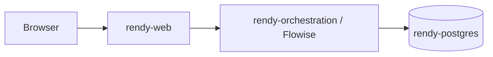

# Rendy on Render

This repository is a deployment template for a small multi-service AI app on Render. It splits the system into three clear responsibilities:

- `rendy-postgres` stores durable state.
- `rendy-orchestration` runs Flowise and owns the chatflows.
- `rendy-web` serves the React UI and proxies browser requests to Flowise.

That split is deliberate. It keeps the user-facing app simple, keeps Flowise off the public browser path, and makes it easier to change one layer without rebuilding the whole stack.

## TL;DR

- Fork this repo for the Blueprint and UI.
- Fork Flowise and point `rendy-orchestration.repo` in [`render.yaml`](render.yaml) to your Flowise fork.
- Deploy the Blueprint from [`render.yaml`](render.yaml) to create `rendy-postgres`, `rendy-orchestration`, and `rendy-web`.
- Move the three services into one Render project if needed.
- Open Flowise, finish initial setup, and add your OpenAI and Postgres credentials.
- Enable `pgvector` in the target Postgres database with `CREATE EXTENSION vector;` if you will store embeddings there.
- Import [`chatflows/pgvector-template.json`](chatflows/pgvector-template.json) and configure the ingestion flow.
- Import [`chatflows/assistant-template.json`](chatflows/assistant-template.json) and configure the assistant flow against the same data.
- Copy the assistant chatflow ID from Flowise and set `VITE_FLOWISE_CHATFLOW_ID` on `rendy-web`.
- Redeploy `rendy-web` and test the full path in the browser.

## What You Get At The End

By the end of this setup, you should have:

- a Render Blueprint that can recreate the app reliably
- a Flowise instance with two imported starter chatflows
- a pgvector-backed retrieval workflow for embeddings/upserts
- a UI that talks to one specific Flowise assistant by chatflow ID



The journey matters here: first you get infrastructure, then data, then an assistant, then a UI wired to the assistant. Each step gives you something concrete to validate before you move on.

## Why This Layout

### Blueprint-first deployment

The stack starts with [`render.yaml`](render.yaml) because repeatable infrastructure is the hard part to recover once a project grows. This is the part that feels good immediately: the Blueprint does the boring, failure-prone wiring for you instead of making you hand-enter hostnames, ports, passwords, secrets, and service references across multiple dashboards.

What makes the Blueprint so useful here is that it already wires most of the stack before you touch Flowise:

- it creates the three core resources: `rendy-postgres`, `rendy-orchestration`, and `rendy-web`
- it injects Flowise database settings from Render Postgres into `DATABASE_HOST`, `DATABASE_PORT`, `DATABASE_NAME`, `DATABASE_USER`, and `DATABASE_PASSWORD`
- it generates the sensitive Flowise/runtime secrets for you, including `EXPRESS_SESSION_SECRET`, `JWT_AUTH_TOKEN_SECRET`, `JWT_REFRESH_TOKEN_SECRET`, `TOKEN_HASH_SECRET`, and `FLOWISE_SECRETKEY_OVERWRITE`
- it mounts persistent storage for Flowise and preconfigures `SECRETKEY_PATH`, `LOG_PATH`, and `BLOB_STORAGE_PATH`
- it wires the UI to Flowise over Render's private network by setting `FLOWISE_INTERNAL_HOSTPORT` from the `rendy-orchestration` service
- it preloads sane UI defaults like `VITE_FLOWISE_PROXY_BASE=/api/flowise` and `VITE_FLOWISE_STREAMING=true`

That means the first deploy is not just "infrastructure exists." It is already a connected system with service discovery, env scaffolding, and most of the operational plumbing in place.

### Separate Flowise and UI services

The UI service is not talking directly to a public Flowise URL from the browser. Instead, the Express layer in [`UI/rendy_rt/api/flowiseProxy.js`](UI/rendy_rt/api/flowiseProxy.js) forwards `/api/flowise/*` requests to Flowise over Render's internal network. That choice keeps the browser same-origin, reduces CORS and auth friction, and lets you change orchestration details without rewriting the frontend.

### Two chatflows instead of one

The two JSON files in [`chatflows/`](chatflows) are intentionally split:

- [`chatflows/pgvector-template.json`](chatflows/pgvector-template.json) is the ingestion/upsert template.
- [`chatflows/assistant-template.json`](chatflows/assistant-template.json) is the assistant template.

This separation makes debugging much easier. If retrieval is wrong, you can fix the upsert flow without touching the assistant. If the assistant prompt is wrong, you can change that without reindexing data.

### Chatflow ID is a deployment-time setting

`VITE_FLOWISE_CHATFLOW_ID` is blank in [`render.yaml`](render.yaml) on purpose. A chatflow UUID does not exist until after Flowise is running and you have created or imported the assistant workflow. Leaving it empty forces the final wiring step to happen explicitly instead of pretending the app is ready before the assistant exists.

## The Files That Matter Most

- [`render.yaml`](render.yaml): provisions the database, Flowise service, and UI service
- [`chatflows/pgvector-template.json`](chatflows/pgvector-template.json): starter ingestion flow using OpenAI embeddings plus Postgres/pgvector
- [`chatflows/assistant-template.json`](chatflows/assistant-template.json): starter assistant that queries the vector store through a retriever tool
- [`UI/rendy_rt/api/flowiseProxy.js`](UI/rendy_rt/api/flowiseProxy.js): private-network proxy from the UI to Flowise
- [`UI/rendy_rt/src/App.tsx`](UI/rendy_rt/src/App.tsx): frontend logic that reads the configured chatflow and sends predictions
- [`ETL/README.md`](ETL/README.md): optional ETL helpers if you want more than the Flowise upload path

## More Examples In This Repo

If you want more than the default deployment path, this checkout already includes a few starter ETL and workflow patterns you can adapt:

- [`ETL/json-ETL/json_to_pinecone.py`](ETL/json-ETL/json_to_pinecone.py): ingests a JSON array or JSONL file of `{url, text}` records, chunks content, embeds it, and upserts it into Pinecone with ledger-based change tracking and optional sync-delete. This is the best example when your source is a crawler export, CMS export, or internal dataset dump.
- [`ETL/sitemap-ETL/sitemap.py`](ETL/sitemap-ETL/sitemap.py): fetches sitemap XML with Playwright, extracts `<loc>` URLs, normalizes and filters them, then embeds the URL strings into Pinecone. This is a good lightweight pattern when you want discovery coverage before doing full-content ingestion.
- [`chatflows/pgvector-template.json`](chatflows/pgvector-template.json): a Flowise ingestion template that connects document input, text splitting, OpenAI embeddings, a Postgres vector store, and a Postgres record manager. This is the closest example to a managed "embedding upsert workflow."
- [`chatflows/assistant-template.json`](chatflows/assistant-template.json): a Flowise assistant template that combines ChatOpenAI, Buffer Memory, a Retriever Tool, and the same Postgres-backed vector store. This is the example to copy when you want a grounded assistant over data you already indexed.

These examples are intentionally different in shape. One starts from exported JSON, one starts from sitemap URLs, one handles ingestion inside Flowise, and one handles the assistant layer. Together they show how the same multi-service app can support both batch ETL and interactive retrieval without forcing everything into a single workflow.

## The UI Is A Template

The UI under [`UI/rendy_rt/`](UI/rendy_rt) should be treated as a starter shell, not a fixed product. It already gives you a working chat surface, a same-origin Flowise proxy, recent-chat history, file upload hooks, citations, feedback controls, and downloadable answers. The intended workflow is to keep that structure and swap the domain-specific parts for your own brand, prompts, and navigation.

That is useful because it means you do not have to redesign the chat app every time you build a new assistant. You can keep the working interaction model and only change the parts that make the experience feel specific to your use case.

### What To Change First

- Branding and shell copy live in [`UI/rendy_rt/src/App.tsx`](UI/rendy_rt/src/App.tsx). The left sidebar brand, the main header title, and the message labels are all plain JSX text, so renaming `Rendy` to your own assistant is straightforward.
- The starter greeting lives in `initialAssistantMessage` near the top of [`UI/rendy_rt/src/App.tsx`](UI/rendy_rt/src/App.tsx). Change that if you want the first message to sound less like a demo and more like your product.
- The prompt tiles live in the `suggestionCards` array near the top of [`UI/rendy_rt/src/App.tsx`](UI/rendy_rt/src/App.tsx). Add, remove, rename, or reorder cards there.
- The quick links in the left rail live in `navShortcuts` in [`UI/rendy_rt/src/App.tsx`](UI/rendy_rt/src/App.tsx). Replace the Render-specific links with docs, dashboards, or workflows that matter for your users.
- The input placeholder and button copy also live in [`UI/rendy_rt/src/App.tsx`](UI/rendy_rt/src/App.tsx), so changing `Ask Rendy` to your own voice is just a text edit.
- The visual system lives in [`UI/rendy_rt/src/App.css`](UI/rendy_rt/src/App.css). That is where you adjust colors, spacing, card styling, header treatment, and mobile behavior.
- Image assets live in [`UI/rendy_rt/public/`](UI/rendy_rt/public). Swap files like `rendy-bot.png` and `rendy-render-logo.svg` when you want the shell to stop looking like the starter brand.

### How The Tiles Work

The tiles are just the items in `suggestionCards`. Each object has:

- a `title`, which is the small heading on the card
- a `prompt`, which is what gets injected into the composer when the card is clicked

That design choice is intentional. It makes the homepage feel curated without adding extra backend logic. If you want the assistant to lead users toward useful questions, the tiles are the fastest way to do it.

The grid only shows before a conversation starts. Once the user begins chatting, the conversation panel takes over. That means the tile set is effectively your "first impression" layer, so it is worth tailoring it to the actual jobs your users need to get done.

### Good Tile Patterns

- task-based cards: `Summarize this release note`, `Review this architecture`, `Draft a migration plan`
- role-based cards: `For support engineers`, `For SREs`, `For sales engineers`
- data-aware cards: `Ask about our docs`, `Search product specs`, `Summarize uploaded files`
- lifecycle cards: `Plan`, `Deploy`, `Troubleshoot`, `Optimize`

If the assistant is domain-specific, the tiles should sound domain-specific too. Generic cards make the UI feel like a demo. Focused cards make it feel intentional.

### Common UI Customizations

- Rebrand the sidebar title, header, and greeting so the assistant has a clear identity.
- Replace the suggestion-card prompts with the top six things your users actually ask.
- Swap the shortcut links so the left rail points at your docs, status pages, dashboards, or runbooks.
- Change the placeholder and CTA copy so the composer matches your tone.
- Update the logos in [`UI/rendy_rt/public/`](UI/rendy_rt/public) so screenshots and exports no longer carry the starter brand.
- Tweak the palette and card styling in [`UI/rendy_rt/src/App.css`](UI/rendy_rt/src/App.css) if you want the interface to feel more productized than template-like.

### When To Keep The Template As-Is

Keep the existing layout if your real differentiation is the assistant behavior, not the chrome around it. The current shell already covers the hard parts of a usable chat UI:

- recent-thread recall
- Flowise proxying
- streaming responses
- citations and artifacts
- feedback hooks
- response downloads

That is usually enough to get a multi-service app deployed and useful before you invest in deeper front-end customization.

## Repository Requirements

For a clean deployment, assume you will own two codebases:

- this repo or your fork of it for the Blueprint and `rendy-web`
- your own fork of Flowise for `rendy-orchestration`

That second point matters. If you want `rendy-orchestration` to be a repo-backed Render service you control, fork the official Flowise repository first and then update the `repo:` value for `rendy-orchestration` in [`render.yaml`](render.yaml) to point at your fork.

Why this is worth doing:

- it gives Render a repo under your GitHub account or org to connect to
- it lets you choose when to pull upstream Flowise changes
- it gives you a place to carry any Flowise-side customizations without editing someone else's repo reference
- it matches the setup Flowise documents for deploying on Render

The minimal setup is:

1. Fork the official Flowise repo.
2. Update the `rendy-orchestration.repo` value in [`render.yaml`](render.yaml) to your fork URL.
3. Make sure Render has permission to access that repo if it is private.
4. Deploy the orchestration service from that fork.
5. Keep your fork synced with upstream Flowise when you want updates.

## Deployment Journey

### 1. Deploy the Blueprint

Deploy the repo using [`render.yaml`](render.yaml).

The Blueprint provisions:

- `rendy-postgres`
- `rendy-orchestration`
- `rendy-web`

This is where the Blueprint earns its keep. In one deploy it:

- provisions the Postgres instance that Flowise can use immediately
- passes the Postgres connection details into the Flowise service automatically
- generates the secret env vars that would otherwise be easy to misconfigure or forget
- attaches a persistent disk so Flowise state, logs, and stored assets survive restarts
- connects `rendy-web` to `rendy-orchestration` through `FLOWISE_INTERNAL_HOSTPORT` without exposing that wiring to the browser
- seeds the UI with the proxy settings it needs so the frontend already knows to talk through `/api/flowise`

The only env var intentionally left unfinished is `VITE_FLOWISE_CHATFLOW_ID`. That is a good omission, not a missing feature. A chatflow ID should not exist until you have actually created or imported the assistant you want the UI to use.

If you are adapting this repo for your own app, review the service names and repo references in [`render.yaml`](render.yaml) before deployment. In particular, `rendy-web` should point at your repo or fork. For `rendy-orchestration`, the practical requirement is to fork Flowise and point the `repo:` field at your fork if you want a repo-backed service you control long term. That keeps updates, access, and service ownership under your account instead of depending on a third-party repo reference.

At this point, the skeleton of the app exists even though the assistant is not wired yet.

### 2. Put The Services In One Render Project

If Render did not place the new resources in the project you want, create/select a project and move the three resources into it before continuing.

This is a small step, but it pays off later. Keeping the database, Flowise service, and UI service together makes ownership, billing, environment-variable review, and incident debugging much less scattered.

### 3. Wait For The Base Stack To Settle

Before you touch chatflows, make sure:

- `rendy-orchestration` is healthy
- `rendy-web` has completed its first deploy
- the Postgres service is available

The point of this pause is simple: you want to debug one layer at a time. First confirm the platform wiring, then configure the application logic.

### 4. Set Up Flowise

Open the `rendy-orchestration` service and finish the initial Flowise setup. Then create the credentials you will use inside Flowise, typically:

- an OpenAI credential for chat and embeddings
- a Postgres credential for the vector-store and record-manager nodes

Important: the database connection in [`render.yaml`](render.yaml) wires Flowise itself to Postgres, but the imported Postgres nodes inside your chatflows still need their own credential and target values inside Flowise. That is why this step exists separately from the Blueprint deploy.

Decide here whether your assistant data will live in the same Postgres instance as Flowise metadata or in a separate pgvector-capable Postgres database. Either can work, but making the decision early avoids reindexing later.

If you use Render Postgres as the vector store, make sure `pgvector` is available in the target database before you test retrieval. On Render Postgres 13 and later, you enable it by running:

```sql
CREATE EXTENSION vector;
```

### 5. Import The Two Starter Chatflows

Import both files from [`chatflows/`](chatflows) into Flowise.

#### A. `pgvector-template.json`

Use [`chatflows/pgvector-template.json`](chatflows/pgvector-template.json) as your ingestion template.

Update the imported nodes so they match your environment:

- OpenAI credential/model
- Postgres credential, host, database, SSL setting, and table name
- record-manager values
- input file or document source

This template exists so you can prove the data path first: load documents, chunk them, embed them, and upsert them into Postgres before you involve the assistant UI.

The committed JSON includes example values. Treat them as placeholders, not production settings.

#### B. `assistant-template.json`

Use [`chatflows/assistant-template.json`](chatflows/assistant-template.json) as your assistant template.

Update the imported nodes so they match the vector store you populated:

- OpenAI chat credential/model
- Postgres host, database, SSL setting, and table name
- retriever tool name/description
- system prompt

Point this assistant at the same vector data you populated in the previous step. That is the real handoff between "I stored embeddings" and "I can answer grounded questions."

When this step is done, you have a working assistant inside Flowise even before the UI is involved.

### 6. Copy The Assistant Chatflow ID Into The UI Service

Once the assistant chatflow is saved in Flowise, copy its UUID and set it on `rendy-web`:

```bash
VITE_FLOWISE_CHATFLOW_ID=<your-assistant-chatflow-uuid>
```

The other important UI settings are already scaffolded in [`render.yaml`](render.yaml):

```bash
FLOWISE_INTERNAL_HOSTPORT=<from rendy-orchestration service>
VITE_FLOWISE_PROXY_BASE=/api/flowise
VITE_FLOWISE_STREAMING=true
```

#### How To Get The Chatflow ID

Use the ID from the assistant chatflow, not the pgvector upsert flow.

The simplest way to get it is:

1. Open the imported assistant chatflow in Flowise.
2. Make sure the flow is saved after you finish your model, Postgres, retriever, and prompt configuration.
3. Open the Flowise API or Embed view for that flow.
4. Copy either:
   - the generated Prediction API URL, where the last path segment in `/api/v1/prediction/<chatflow-id>` is the value you need, or
   - the generated embed snippet, where the `chatflowid: '...'` value is the same ID.
5. Paste that UUID into `VITE_FLOWISE_CHATFLOW_ID` on `rendy-web`.

If you imported both starter templates, double-check that you copied the ID from the assistant flow and not from the ingestion/upsert flow. A good habit is to rename the two imported flows clearly before you copy anything, for example:

- `Rendy PGVector Upsert`
- `Rendy Assistant`

If the UI path is not obvious, you can fall back to Flowise's chatflow listing API and match by name. The chatflow objects include both `id` and `name`, so you can identify the correct flow without guessing.

Redeploy `rendy-web` after setting the chatflow ID.

This is the final wiring step because the UI is intentionally coupled to one assistant at a time. [`UI/rendy_rt/api/flowiseProxy.js`](UI/rendy_rt/api/flowiseProxy.js) reads that env var and forwards prediction and feedback calls to the matching Flowise chatflow.

At this point, the browser can use the assistant without knowing the Flowise host directly.

### 7. Test End To End

Now test the full path:

1. Open the deployed `rendy-web` app.
2. Ask a question that should be answerable from the content you upserted.
3. Confirm the response is grounded in your stored data, not just generic model behavior.

If you want a quick mental model for failures:

- Flowise works but the UI fails: usually a proxy or env-var problem.
- The UI says the chatflow is not configured: `VITE_FLOWISE_CHATFLOW_ID` is missing or the service was not redeployed.
- The assistant answers vaguely: the ingestion flow and the assistant are probably not pointing at the same Postgres table/data.

If this test passes, the rewarding part is that you now have a reproducible pattern, not just a one-off demo. Infrastructure, orchestration, retrieval, and UI are all separated cleanly enough to evolve independently.

## Local Development

If you want to work on the UI locally:

```bash
cd UI/rendy_rt
npm install
npm run dev
```

For local proxying, Vite reads `FLOWISE_PROXY_TARGET` and defaults to `http://localhost:3000`. Production-style server behavior uses `FLOWISE_INTERNAL_HOSTPORT` instead. See [`UI/rendy_rt/README.md`](UI/rendy_rt/README.md) for the UI-specific details.

## Official Docs

### Flowise

- [Flowise deployment overview](https://docs.flowiseai.com/configuration/deployment)
- [Deploy Flowise on Render](https://docs.flowiseai.com/configuration/deployment/render)
- [Flowise environment variables](https://docs.flowiseai.com/configuration/environment-variables)
- [Flowise Prediction API](https://docs.flowiseai.com/using-flowise/prediction)
- [Flowise Embed docs](https://docs.flowiseai.com/using-flowise/embed)
- [Flowise Chatflows API](https://docs.flowiseai.com/api-reference/chatflows)

### Render

- [Render Blueprints overview](https://render.com/docs/infrastructure-as-code)
- [Blueprint YAML reference](https://render.com/docs/blueprint-spec)
- [Render web services](https://render.com/docs/web-services)
- [Docker on Render](https://render.com/docs/docker)
- [Private network](https://render.com/docs/private-network)
- [Environment variables and secrets](https://render.com/docs/configure-environment-variables)
- [Connect GitHub](https://render.com/docs/github)
- [Create and connect to Render Postgres](https://render.com/docs/databases)
- [Render Postgres overview](https://render.com/docs/postgresql)
- [Supported extensions for Render Postgres (`pgvector`)](https://render.com/docs/postgresql-extensions)
- [Persistent disks](https://render.com/docs/disks)

## Common Mistakes

- Deploying the Blueprint and assuming the app is fully usable before a chatflow exists
- Importing the templates but leaving the example Postgres host/database/table values unchanged
- Testing the assistant before running the upsert/indexing flow
- Pointing the assistant retriever at a different table than the ingestion flow used
- Forgetting to redeploy `rendy-web` after setting `VITE_FLOWISE_CHATFLOW_ID`

## What To Customize For Your Own App

If you are using this repo as a starting point for a different multi-service app, the main things to customize are:

- service names in [`render.yaml`](render.yaml)
- the UI repo reference in [`render.yaml`](render.yaml)
- the two Flowise templates in [`chatflows/`](chatflows)
- the frontend copy and prompts in [`UI/rendy_rt/src/App.tsx`](UI/rendy_rt/src/App.tsx)
- any ETL or data-shaping helpers under [`ETL/`](ETL)

The architecture can stay the same even if the domain changes. That is the real reason this layout exists: it gives you a reusable deployment pattern, not just a single hardcoded assistant.
