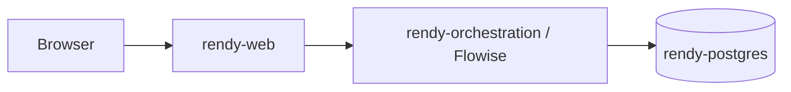

# Rendy on Render

Rendy is a small multi-service starter for running a Flowise-backed assistant on Render. This repo keeps the deployment blueprint, UI shell, starter chatflows, and ETL helpers separate so you can swap one layer without rebuilding everything else.

## Service Layout

- `rendy-postgres` stores Flowise metadata and can also host your pgvector data if you want one database.
- `rendy-orchestration` runs the full Flowise orchestration server, not just one chat endpoint.
- `rendy-web` serves the React UI and proxies browser requests to Flowise over Render's private network.



## What `rendy-orchestration` Supports

`rendy-orchestration` is the main Flowise runtime in this stack. It is the place where you get:

- Access surfaces: Flowise HTTP API, Command Line Interface, Python SDK (`pip install flowise`), and TypeScript/Node SDK (`npm install flowise-sdk`)
- Builders and runtime modes: Assistant, Chatflow, and Agentflow
- Orchestration primitives: open-source and proprietary model support, expressions, custom code, branching, looping, routing, and complex workflow orchestration
- Integration families: LangChain agents, cache, chains, chat models, document loaders, embeddings, LLMs, memory, moderation, output parsers, prompts, record managers, retrievers, text splitters, tools, and vector stores
- Additional libraries and utilities: LlamaIndex agents, chat models, embeddings, engines, response synthesizers, tools, and vector stores; utilities like Custom JS Function, Set/Get Variable, If Else, Set Variable, and Sticky Note; external integrations like Zapier Zaps
- Tooling extensions: MCP client/server support plus custom JS tools that can use built-in Node modules and supported external libraries

That is why `rendy-web` is kept thin. The UI is only the browser-facing shell; the orchestration service is where the agent runtime, tools, SDK/API surface, and most integration logic live.

## What Lives Here

- [`render.yaml`](render.yaml): Render Blueprint for the three-service stack.
- [`chatflows/assistant-template.json`](chatflows/assistant-template.json): starter Flowise assistant flow.
- [`chatflows/pgvector-template.json`](chatflows/pgvector-template.json): starter ingestion/upsert flow.
- [`UI/rendy_rt/`](UI/rendy_rt): React + TypeScript + Vite UI with an Express `/api/flowise` proxy.
- [`ETL/`](ETL): optional Pinecone-oriented ETL helpers for JSON and sitemap inputs.

## Quick Start

1. Fork this repo for the Blueprint and UI.
2. Fork Flowise and update the `rendy-orchestration.repo` value in [`render.yaml`](render.yaml) to your Flowise fork.
3. Review the `repo:` entries in [`render.yaml`](render.yaml) so `rendy-web` points at your repo and `rendy-orchestration` points at your Flowise fork.
4. Deploy the Blueprint from [`render.yaml`](render.yaml).
5. Open Flowise, complete its first-run setup, and create the OpenAI/Postgres credentials you want to use inside the imported nodes.
6. If you plan to store embeddings in Postgres/pgvector, enable the extension in the target database:

```sql
CREATE EXTENSION vector;
```

7. Import [`chatflows/pgvector-template.json`](chatflows/pgvector-template.json) and [`chatflows/assistant-template.json`](chatflows/assistant-template.json) into Flowise.
8. Copy the assistant chatflow ID into `VITE_FLOWISE_CHATFLOW_ID` on `rendy-web`.
9. Redeploy `rendy-web` and test an end-to-end question in the browser.

## Important Deployment Notes

- `VITE_FLOWISE_CHATFLOW_ID` is intentionally blank in [`render.yaml`](render.yaml). The UI cannot be fully wired until the assistant chatflow exists.
- The UI talks to Flowise through [`UI/rendy_rt/api/flowiseProxy.js`](UI/rendy_rt/api/flowiseProxy.js), not by exposing Flowise directly to the browser.
- The Blueprint already seeds `FLOWISE_INTERNAL_HOSTPORT`, `VITE_FLOWISE_PROXY_BASE=/api/flowise`, and `VITE_FLOWISE_STREAMING=true` for `rendy-web`.

## Local UI Development

For the current UI, `npm run dev` does not run plain Vite. It starts [`UI/rendy_rt/server.js`](UI/rendy_rt/server.js), which mounts the Express API router at `/api` and runs Vite in middleware mode.

```bash
cd UI/rendy_rt
npm install
```

Create `UI/rendy_rt/.env.local` with at least:

```bash
VITE_FLOWISE_PROXY_BASE=/api/flowise
VITE_FLOWISE_CHATFLOW_ID=<assistant-chatflow-id>
VITE_FLOWISE_STREAMING=true
FLOWISE_INTERNAL_HOSTPORT=localhost:3000
```

Then start the UI:

```bash
npm run dev
```

Useful distinction:

- `npm run dev` and `npm run start` use `FLOWISE_INTERNAL_HOSTPORT`.
- `vite preview` and the proxy config in [`UI/rendy_rt/vite.config.ts`](UI/rendy_rt/vite.config.ts) use `FLOWISE_PROXY_TARGET`, which defaults to `http://localhost:3000`.

See [`UI/rendy_rt/README.md`](UI/rendy_rt/README.md) for the full UI-specific environment matrix.

## ETL Helpers

The current ETL examples in this checkout are:

- [`ETL/json-ETL/json_to_pinecone.py`](ETL/json-ETL/json_to_pinecone.py): JSON/JSONL `{url, text}` ingestion into Pinecone with chunking, ledgers, and optional sync-delete.
- [`ETL/sitemap-ETL/sitemap.py`](ETL/sitemap-ETL/sitemap.py): Playwright-based sitemap fetcher that extracts `<loc>` URLs and embeds the URL strings into Pinecone.

See [`ETL/README.md`](ETL/README.md) for current ETL details.

## Common Failure Points

- `Flowise chatflow is not configured` means `VITE_FLOWISE_CHATFLOW_ID` is empty or the UI was not redeployed after setting it.
- `Unable to reach Flowise...` errors usually mean `FLOWISE_INTERNAL_HOSTPORT` is wrong or Flowise is not healthy.
- Weak or generic answers usually mean the assistant flow is not pointed at the same vector data the ingestion flow populated.
- `vite preview` proxy failures are usually `FLOWISE_PROXY_TARGET` issues; `npm run dev` uses a different path.

## Repository Pointers

- UI details: [`UI/rendy_rt/README.md`](UI/rendy_rt/README.md)
- ETL details: [`ETL/README.md`](ETL/README.md)
- Blueprint: [`render.yaml`](render.yaml)
